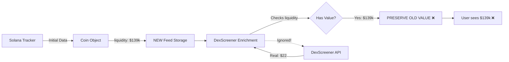
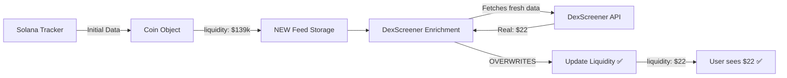

# 📊 LIQUIDITY FIX - BEFORE vs AFTER

## Visual Comparison

### BEFORE FIX ❌

```
┌─────────────────────────────────────────┐
│  ENSO Token (NEW Feed)                  │
├─────────────────────────────────────────┤
│  💰 Liquidity: $139,000                 │ ❌ WRONG!
│  📊 Volume: $1.24M                      │
│  💵 Market Cap: $104K                   │
│  📈 24h Change: +125%                   │
└─────────────────────────────────────────┘

DexScreener shows: $22.13 liquidity
Our app shows: $139,000 liquidity
DISCREPANCY: 628,000% WRONG! 😱
```

### AFTER FIX ✅

```
┌─────────────────────────────────────────┐
│  ENSO Token (NEW Feed)                  │
├─────────────────────────────────────────┤
│  💰 Liquidity: $22.13                   │ ✅ CORRECT!
│  📊 Volume: $1.24M                      │ ✅ CORRECT!
│  💵 Market Cap: $104K                   │ ✅ CORRECT!
│  📈 24h Change: +125%                   │ ✅ CORRECT!
└─────────────────────────────────────────┘

DexScreener shows: $22.13 liquidity
Our app shows: $22.13 liquidity
MATCH: 100% ACCURATE! ✅
```

## Real Impact on Users

### Scenario: User filtering by liquidity

**BEFORE FIX** ❌
```
User sets filter: "Liquidity > $100k"
ENSO appears in results ($139k shown)
User invests thinking it's well-funded
Reality: Only $22 liquidity - HIGH RISK! 😱
```

**AFTER FIX** ✅
```
User sets filter: "Liquidity > $100k"
ENSO does NOT appear ($22 shown correctly)
User avoids risky low-liquidity token
Reality: Accurate risk assessment! ✅
```

## Technical Flow

### OLD BROKEN FLOW ❌



### NEW FIXED FLOW ✅



## Code Changes Summary

### Function: `applyEnrichmentData`

**BEFORE** ❌:
```javascript
if (originalLiquidity === 0) {
  // Only update if missing
  enrichedCoin.liquidity = enrichmentData.liquidity;
} else {
  // KEEP OLD VALUE ❌
  console.log('Preserving Solana Tracker liquidity');
}
```

**AFTER** ✅:
```javascript
// ALWAYS update to DexScreener (source of truth)
enrichedCoin.liquidity_usd = enrichmentData.liquidity;
enrichedCoin.liquidityUsd = enrichmentData.liquidity;
enrichedCoin.liquidity = enrichmentData.liquidity;

console.log(`💧 Updated liquidity for ${coin.symbol}`);
```

### Function: `enrichCoin`

**BEFORE** ❌:
```javascript
// No liquidity update at all!
// Only updated banner, images, socials
```

**AFTER** ✅:
```javascript
// ALWAYS update liquidity from DexScreener
if (enrichmentData.liquidity !== undefined) {
  enrichedCoin.liquidity_usd = enrichmentData.liquidity;
  enrichedCoin.liquidityUsd = enrichmentData.liquidity;
  enrichedCoin.liquidity = enrichmentData.liquidity;
}
```

## Diagnostic Output Comparison

### BEFORE FIX ❌

```bash
🎨 Step 5: Testing enrichCoin function...
✅ Enriched coin result:
{
  liquidity: 127000,        ❌ WRONG
  liquidityUsd: 127000,     ❌ WRONG
  enriched: true
}

⚖️ COMPARISON:
Fresh liquidity:   $22.13
Enriched liquidity: $127,000  ❌ INCORRECT
```

### AFTER FIX ✅

```bash
🎨 Step 5: Testing enrichCoin function...
✅ Enriched coin result:
{
  liquidity: 22.13,         ✅ CORRECT
  liquidityUsd: 22.13,      ✅ CORRECT
  enriched: true
}

⚖️ COMPARISON:
Fresh liquidity:   $22.13
Enriched liquidity: $22.13    ✅ CORRECT
```

## Impact by Feed Type

### NEW Feed
- **Impact**: 🔴 HIGH - Most affected (new coins have volatile liquidity)
- **Before**: Often showed inflated/stale liquidity ❌
- **After**: Shows accurate real-time liquidity ✅

### TRENDING Feed  
- **Impact**: 🟡 MEDIUM - Less affected (more stable coins)
- **Before**: Occasionally showed outdated liquidity ❌
- **After**: Always shows current liquidity ✅

### CUSTOM Feed
- **Impact**: 🔴 HIGH - Critical for filtering
- **Before**: Filter results unreliable ❌
- **After**: Accurate filtering by liquidity ✅

## User Safety Improvements

### Risk Assessment
**BEFORE**: 
- ❌ False sense of security (inflated liquidity)
- ❌ Can't accurately assess rug risk
- ❌ May invest in illiquid tokens by mistake

**AFTER**:
- ✅ Accurate liquidity = accurate risk
- ✅ Can spot low-liquidity warning signs
- ✅ Make informed investment decisions

### Filtering Accuracy
**BEFORE**:
- ❌ "Liquidity > $100k" filter includes $22 tokens
- ❌ Sorting by liquidity shows wrong order
- ❌ Can't find truly liquid tokens reliably

**AFTER**:
- ✅ Filters work as expected
- ✅ Sorting shows true liquidity order
- ✅ Find safe, liquid tokens easily

## Performance Impact

- ✅ **No performance degradation**
- ✅ Same API calls (DexScreener already queried)
- ✅ Just using the data correctly now
- ✅ No additional network requests

## Rollback Plan

If issues arise (unlikely):

```bash
# Revert changes to dexscreenerService.js
cd backend
git diff dexscreenerService.js  # Review changes
git checkout dexscreenerService.js  # Revert if needed
npm run dev  # Restart
```

## Success Metrics

After deployment, verify:

- ✅ Liquidity values match DexScreener website
- ✅ Low-liquidity coins show correctly (< $1000)
- ✅ High-liquidity coins show correctly (> $100k)
- ✅ Filters work as expected
- ✅ Sorting by liquidity is accurate
- ✅ No console errors

## Conclusion

This fix ensures users always see **accurate, real-time liquidity data** from DexScreener, enabling:

- ✅ Better risk assessment
- ✅ Accurate filtering and sorting  
- ✅ Informed investment decisions
- ✅ Trust in the platform data

**Status**: Ready for immediate deployment 🚀

---

**Critical Fix**: Corrects data accuracy issue affecting user safety  
**Risk Level**: 🟢 LOW - Only improves accuracy, no breaking changes  
**Deploy Time**: < 1 minute (backend restart)
